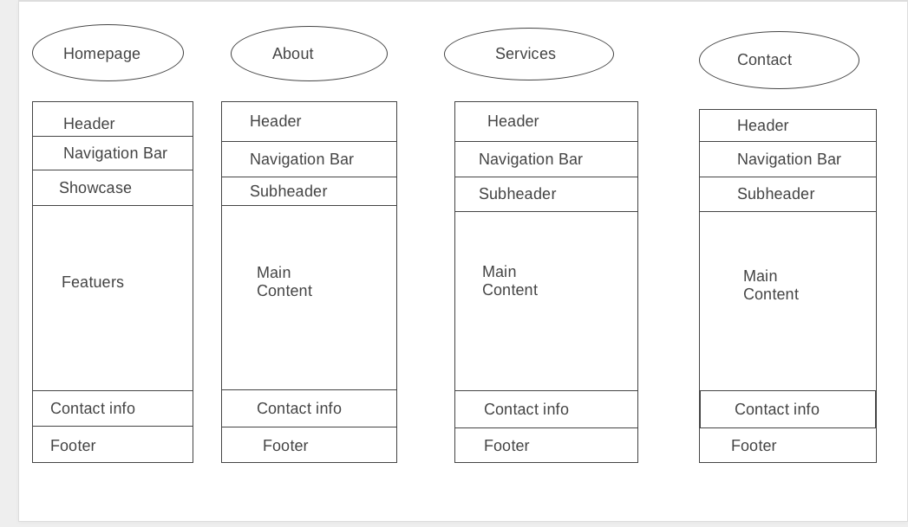

# Development Strategy

> `APPtheme Project`

Creating a website template from tutorial for educational purposes. For this using only HTML5 and CSS3.
Very helpful project for beginners who can join and practice their skills and learn new ones

## Wireframe

<!-- include a wireframe for your project in this repository, and display it here -->
<!-- wireframe.cc is a good site for getting started with wireframes -->

## 0. Set-Up

__A User can see my initial repository and live demo__

### Repo

* Generate repo from the tamplate
* Write initial, basic README
* Add Wireframe
* whrite the development Stratagy
* Turn on GitHub Pages

## 1. Make a header and navigation bar

Made a name of the website, title, manu tabs
### Repo

I worked on branch header

### HTML

* I added tags for header and navigation bar 
* I adde classes or flexbox alignment features for navigation bar
* Used class col-xs-12, col-sm-10, col-md-10, col-lg-10 for layout

### CSS

* In the style sheet added feauters to header to indentify borders
* added feuters to background, nav bar, and lists

## 2.Made a showcase section for the home page

### Repo
Worked on branch showcase.
 * Created tag section with the ID: section
 * Use neccesary calsses for flexbox alignment features
 * Added header 1 and pharagraph tags
 
## 3.Made a features section for the home page

Adde icons for main content of the home page
 ### HTLM
  * Put a tag section with ID features 
  * Use neccesary calsses for flexbox alignment features
  * Downloaded and linked font-awesome.css and use it to get icons
  
  ### CSS
  * Downloaded and added font-awesome.css file in the css folder
  * Added color, font, margin and padding features

  
## 4. Creating the info section for the home page 

### Repo

I worked on branch info-section

### HTML
* Added tag section with ID info
* Use neccesary calsses for flexbox alignment features and layout
* Adde image with the image tag
* Used fa-check class for the list of features

### CSS

* Downloaded and added font-awesome.css file in the css folder
* Added color, font, margin and padding features

## 5. Makde a company section 
 
 ### Repo
 worked on branch company

### HTML

* Added the tag section with the ID company
* Use neccesary calsses for responsive and layout
* Added fa-phone class for the phone number of the company
* Added fa-envelope class for the mail address of the company
* Added fa-map class for the address of the company
* Created a input and button in form tag for subscribe to the newsletter

### CSS
 
 Added background, color, margin and padding features
 
 ## 6. Make a footer for the home page

### Repo
worked on branch footer

* Adde tag section with ID footer
* Use neccesary calsses for flexbox alignment features and layout

### CSS

added background and color feuters

## 7. Create manu page

### Repo

Worked on branch menue

### HTMl

* Adde tag section with ID subheader
* Created a general id name page for the main content of each menu page and class name about, contact and services for each menu
* Created the form tag containing the button and input to enter the information in contact.html for those who want to contact

### CSS

* Added feuters for background, color, margin, padding and font
* Used a media query for the proper AppTheme titel view in main content in mobile responsive view on the home page

## Finishing Touches

- Write final, complete README:
  - [makeareadme.com](https://www.makeareadme.com/)
  - [bulldogjob](https://bulldogjob.com/news/449-how-to-write-a-good-readme-for-your-github-project)
  - [meakaakka](https://medium.com/@meakaakka/a-beginners-guide-to-writing-a-kickass-readme-7ac01da88ab3)
- Validate code to check for any last mistakes
